# Halısaha Yönetim ve Sosyal Ağı

Modern halısaha rezervasyon ve sosyal ağ platformu.

## 🚀 Kurulum

### Gereksinimler
- Node.js (v18 veya üstü)
- PostgreSQL (v14 veya üstü)
- npm veya yarn

### 1. Projeyi Klonlayın
```bash
git clone <repository-url>
cd Halisaha
```

### 2. Backend Kurulumu

```bash
# Backend klasörüne gidin
cd backend

# Bağımlılıkları yükleyin
npm install

# .env dosyasını oluşturun
cp .env.example .env
```

**.env dosyasını düzenleyin:**
```env
PORT=5000
NODE_ENV=development

# PostgreSQL
DB_HOST=localhost
DB_PORT=5432
DB_NAME=halisaha
DB_USER=postgres
DB_PASSWORD=your_password

# JWT
JWT_SECRET=your_super_secret_jwt_key_change_this_in_production
JWT_EXPIRES_IN=7d
```

### 3. Veritabanı Kurulumu

```bash
# PostgreSQL'e bağlanın
psql -U postgres

# Veritabanını oluşturun
CREATE DATABASE halisaha;

# Veritabanından çıkın
\q

# Migration'ları çalıştırın
cd ../database/migrations
psql -U postgres -d halisaha -f 001_create_users.sql
psql -U postgres -d halisaha -f 002_create_venues.sql
psql -U postgres -d halisaha -f 003_create_reservations.sql
psql -U postgres -d halisaha -f 004_create_teams_matches.sql
psql -U postgres -d halisaha -f 005_create_social_features.sql
psql -U postgres -d halisaha -f 006_create_opponent_search.sql
```

### 4. Frontend Kurulumu

```bash
# Frontend klasörüne gidin
cd ../../frontend

# Bağımlılıkları yükleyin
npm install

# .env.local dosyasını oluşturun
cp .env.example .env.local
```

**.env.local dosyasını düzenleyin:**
```env
NEXT_PUBLIC_API_URL=http://localhost:5000/api
```

### 5. Projeyi Çalıştırın

**Backend'i başlatın (bir terminalde):**
```bash
cd backend
npm run dev
```

**Frontend'i başlatın (başka bir terminalde):**
```bash
cd frontend
npm run dev
```

### 6. Tarayıcıda Açın

- **Frontend**: http://localhost:3000
- **Backend API**: http://localhost:5000/api

### İlk Admin Kullanıcısı

Veritabanına ilk admin kullanıcısını eklemek için:

```bash
cd database/seeds
psql -U postgres -d halisaha -f admin_user.sql
```

**Varsayılan admin giriş bilgileri:**
- Email: admin@halisaha.com
- Şifre: Admin123!

> ⚠️ **Önemli**: Üretim ortamında mutlaka şifreyi değiştirin!

## 📸 Uygulama Görselleri
### Ana Sayfa ve Giriş
<table>
  <tr>
    <td>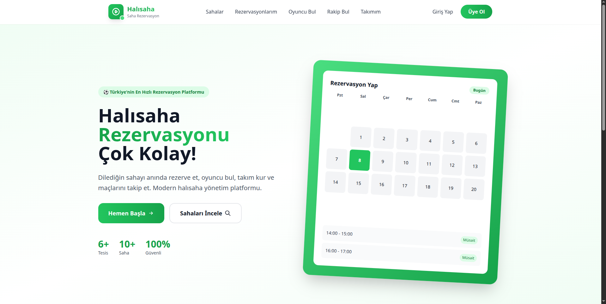<br/><b>Ana Sayfa</b><br/>Modern ve kullanıcı dostu arayüz</td>
    <td>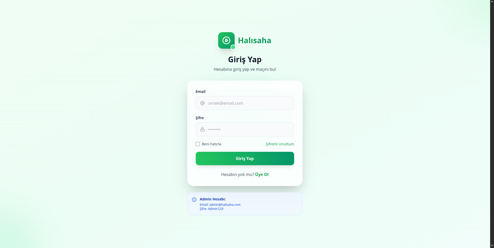<br/><b>Giriş Ekranı</b><br/>Güvenli kullanıcı girişi</td>
  </tr>
  <tr>
    <td>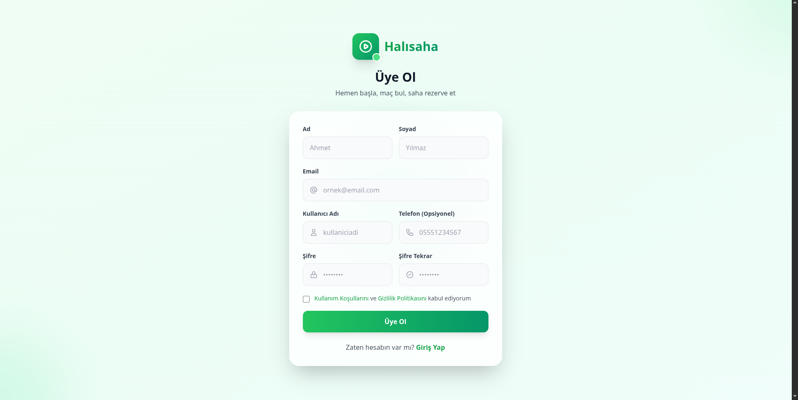<br/><b>Kayıt Ol</b><br/>Hızlı üyelik sistemi</td>
    <td>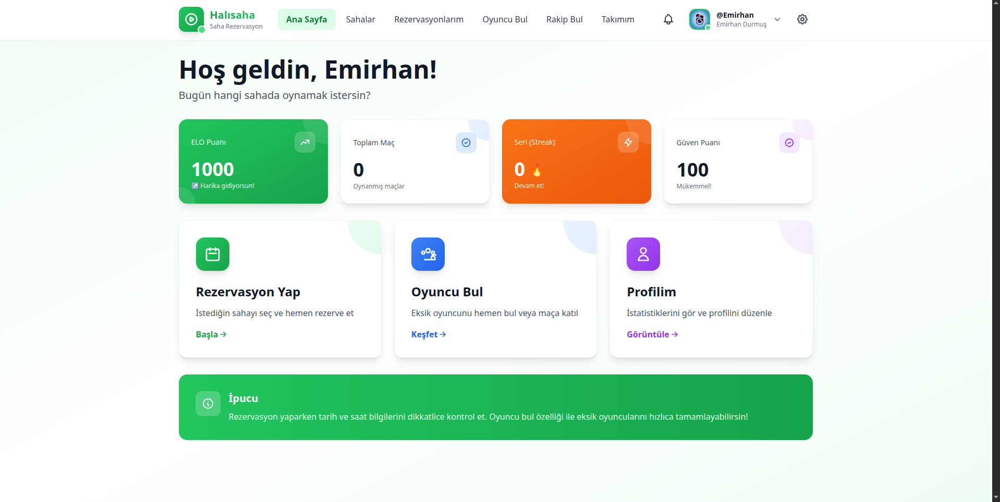<br/><b>Kullanıcı Paneli</b><br/>Kişiselleştirilmiş dashboard</td>
  </tr>
</table>

### Saha ve Rezervasyon
<table>
  <tr>
    <td>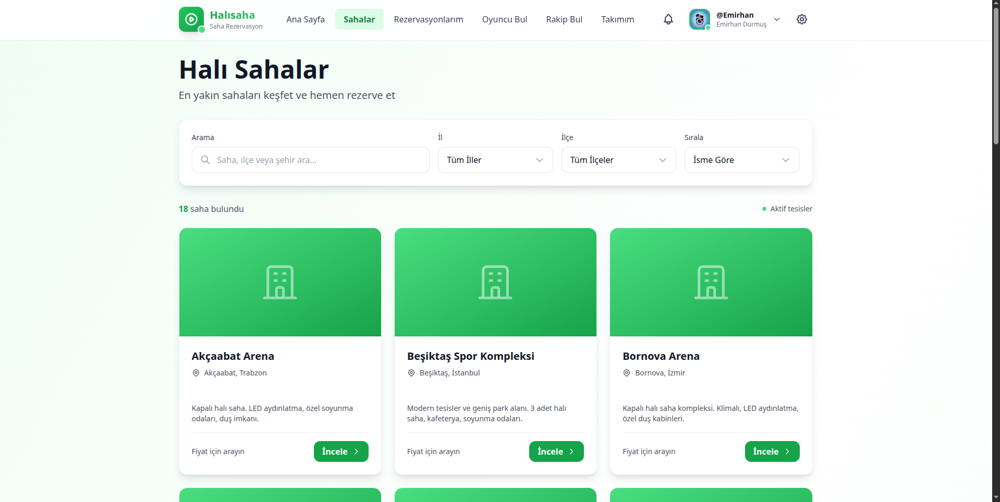<br/><b>Halı Sahalar</b><br/>Filtreleme ve arama özellikleri</td>
    <td><br/><b>Saha Detayı</b><br/>Detaylı bilgi ve rezervasyon</td>
  </tr>
  <tr>
    <td>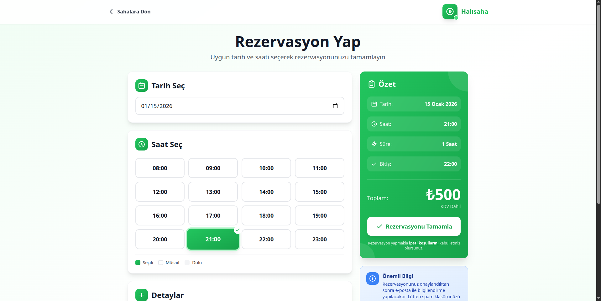<br/><b>Rezervasyon Yap</b><br/>Kolay rezervasyon sistemi</td>
    <td>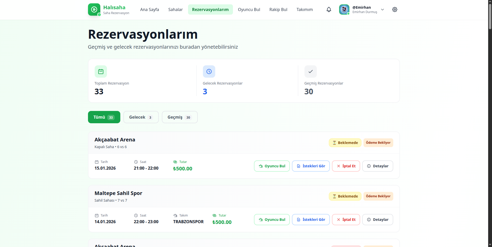<br/><b>Rezervasyonlarım</b><br/>Rezervasyon yönetimi</td>
  </tr>
</table>

### Sosyal Özellikler
<table>
  <tr>
    <td>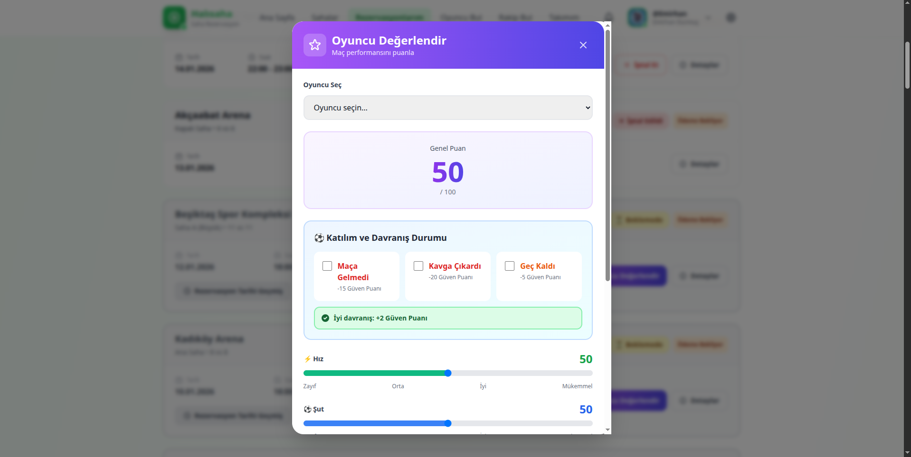<br/><b>Oyuncu Değerlendirme</b><br/>Maç sonrası değerlendirme sistemi</td>
    <td>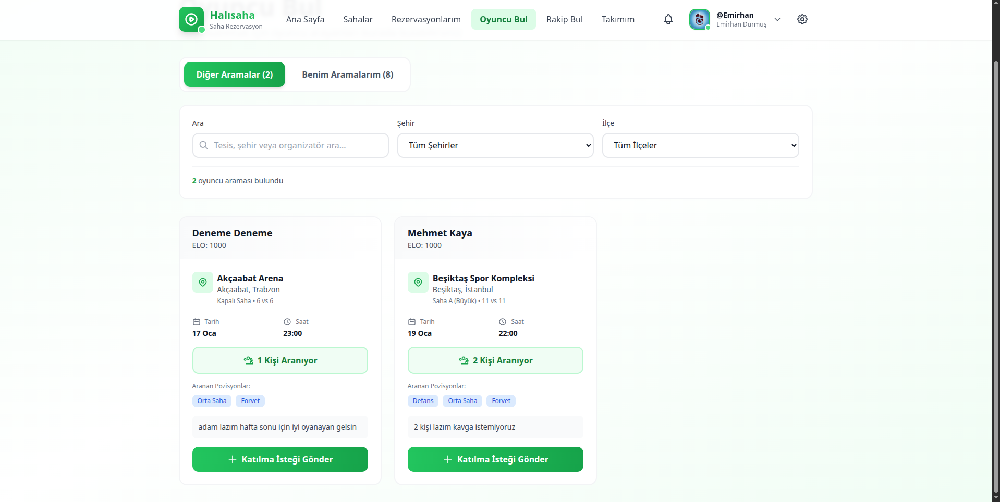<br/><b>Oyuncu Bul</b><br/>Eksik oyuncu arama</td>
  </tr>
  <tr>
    <td>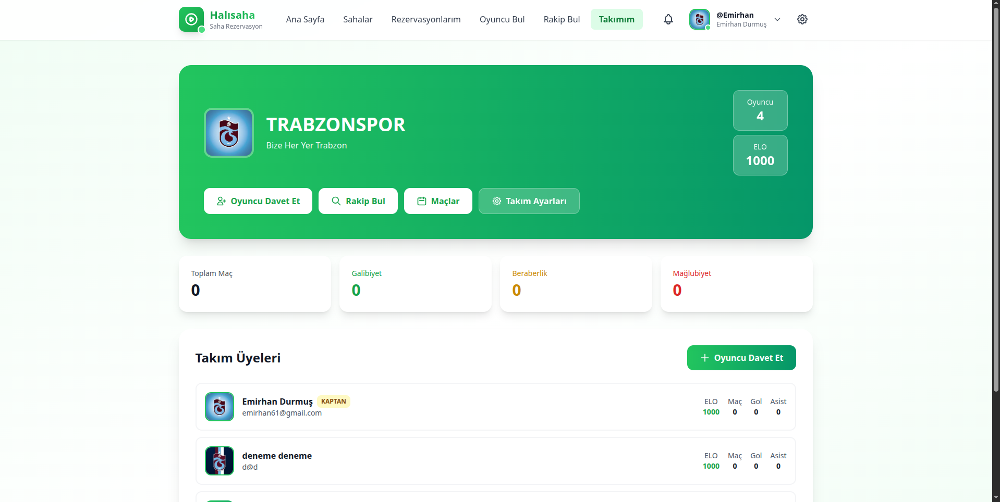<br/><b>Takımım</b><br/>Takım istatistikleri ve üye yönetimi</td>
    <td>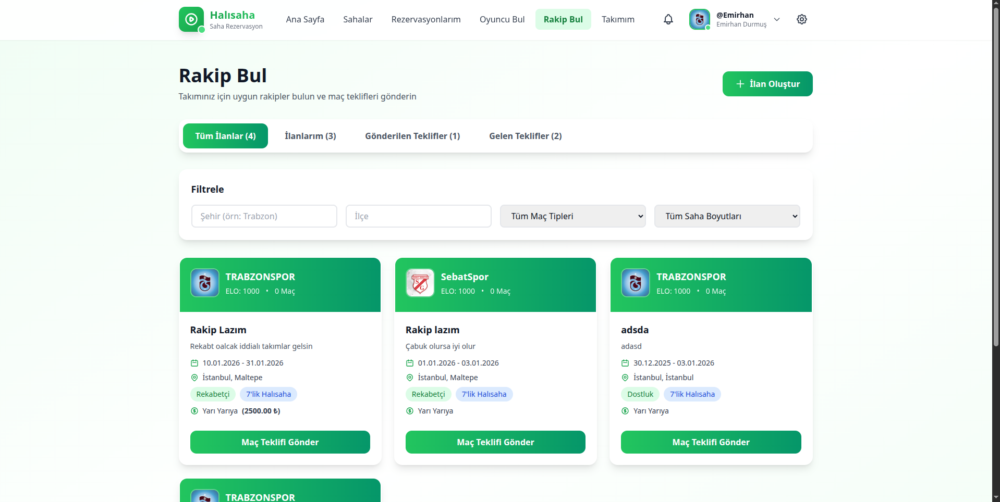<br/><b>Rakip Bul</b><br/>Maç teklifi gönderme sistemi</td>
  </tr>
</table>

### Profil ve Ayarlar
<table>
  <tr>
    <td>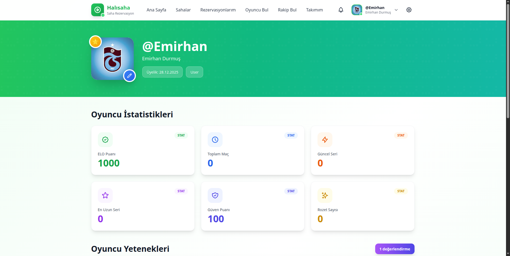<br/><b>Oyuncu İstatistikleri</b><br/>ELO puanı ve performans metrikleri</td>
    <td>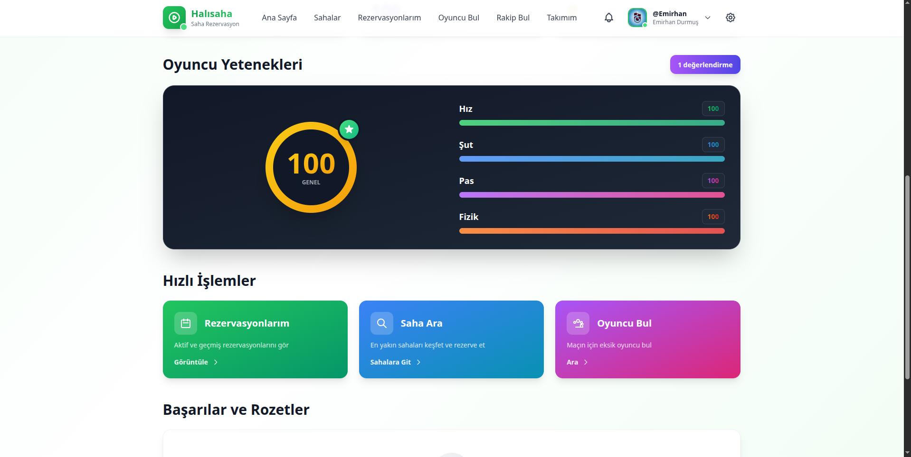<br/><b>Oyuncu Yetenekleri</b><br/>Hız, şut, pas, fizik yetenekleri</td>
  </tr>
  <tr>
    <td>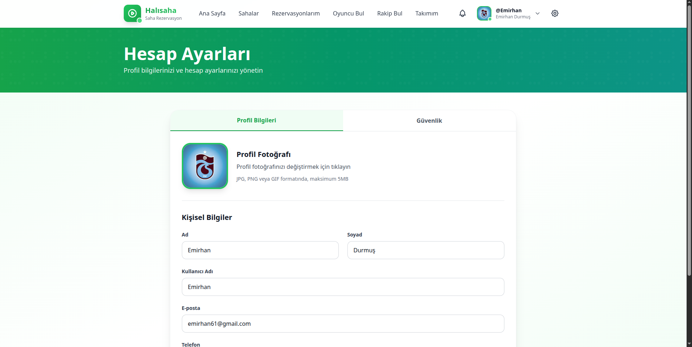<br/><b>Hesap Ayarları</b><br/>Profil düzenleme ve güvenlik</td>
    <td>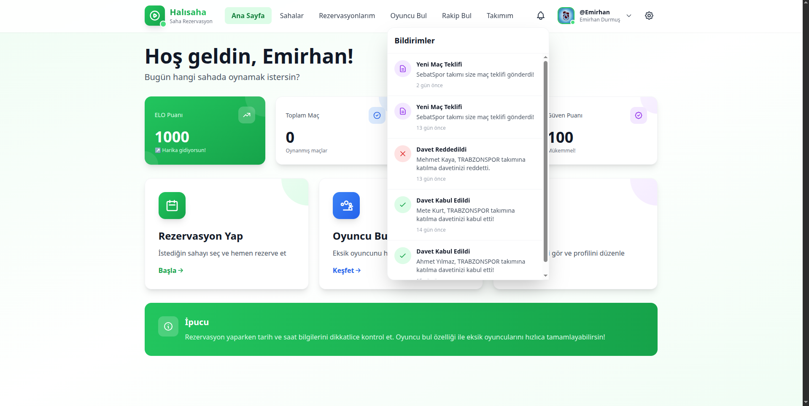<br/><b>Bildirimler</b><br/>Anlık bildirim sistemi</td>
  </tr>
</table>

### Admin Panel
<table>
  <tr>
    <td><br/><b>Admin Paneli</b><br/>Sistem yönetim merkezi</td>
    <td>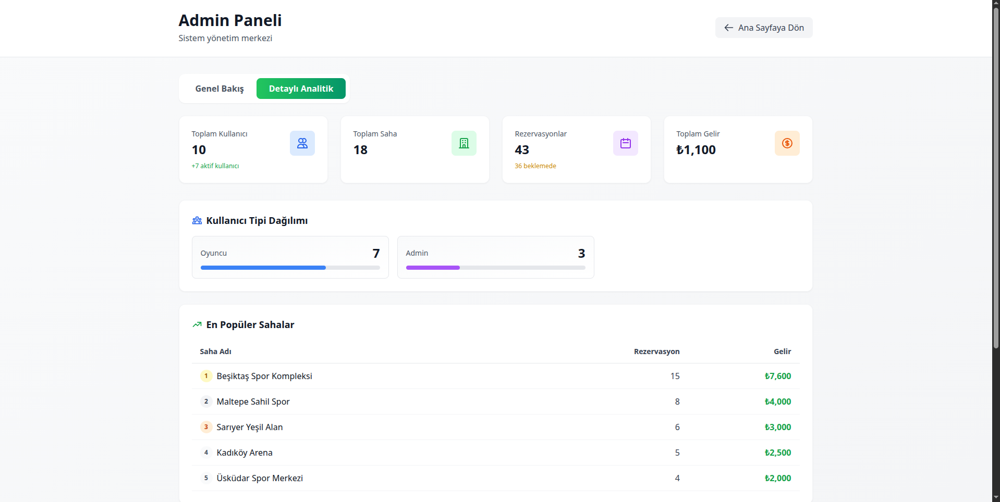<br/><b>Detaylı İstatistikler</b><br/>Gelir ve kullanıcı analizi</td>
  </tr>
</table>

## 📁 Proje Yapısı

```
Halisaha/
├── backend/                 # Node.js + Express Backend
│   ├── src/
│   │   ├── config/         # Veritabanı ve uygulama konfigürasyonları
│   │   ├── controllers/    # Route controller'ları
│   │   ├── middleware/     # Express middleware'leri (auth, validation, vb.)
│   │   ├── models/         # PostgreSQL model tanımları
│   │   ├── routes/         # API route'ları
│   │   ├── services/       # İş mantığı servisleri
│   │   └── utils/          # Yardımcı fonksiyonlar
│   ├── package.json
│   └── tsconfig.json
│
├── frontend/               # Next.js 14+ Frontend
│   ├── src/
│   │   ├── app/           # Next.js App Router (pages)
│   │   ├── components/    # React bileşenleri
│   │   ├── lib/          # Kütüphane yapılandırmaları
│   │   ├── types/        # TypeScript type tanımları
│   │   ├── hooks/        # Custom React hooks
│   │   └── services/     # API çağrıları
│   ├── public/           # Statik dosyalar
│   ├── package.json
│   └── tsconfig.json
│
├── database/              # Veritabanı dosyaları
│   ├── migrations/       # Veritabanı migration'ları
│   └── seeds/           # Seed data
│
└── docs/                 # Proje dokümantasyonu
```

## 🛠 Teknoloji Stack

### Backend
- **Runtime**: Node.js
- **Framework**: Express.js
- **Language**: TypeScript
- **Database**: PostgreSQL
- **ORM**: pg (node-postgres)

### Frontend
- **Framework**: Next.js 14+ (App Router)
- **Language**: TypeScript
- **Styling**: TailwindCSS
- **State Management**: React Context / Zustand

### Database
- **PostgreSQL** with:
  - JSONB for flexible user profiles
  - PostGIS for location services
  - Exclusion Constraints for double booking prevention

## ✨ Ana Özellikler

### 1. **Rezervasyon Sistemi**
   - Gerçek zamanlı saha müsaitlik kontrolü
   - Dinamik fiyatlandırma
   - Otomatik çifte rezervasyon engelleme
   - Tarih ve saat seçimi ile kolay rezervasyon

### 2. **Sosyal Ağ**
   - Kullanıcı profilleri ve istatistikler
   - Takım yönetimi ve üye davetleri
   - Maç geçmişi ve performans takibi
   - ELO tabanlı sıralama sistemi

### 3. **Matchmaking (Eşleştirme)**
   - **Oyuncu Bul**: Eksik oyuncu araması ve katılım talepleri
   - **Rakip Bul**: Takım arası maç organizasyonu
   - ELO tabanlı seviye eşleştirme
   - Pozisyon bazlı filtreleme

### 4. **Gamification**
   - Güvenilir oyuncu puanı (0-100)
   - Rozet ve başarı sistemi
   - Streak (seri) mekanizması
   - Oyuncu değerlendirme sistemi

### 5. **Admin Panel**
   - Kullanıcı ve saha yönetimi
   - Rezervasyon takibi
   - Gelir analizi ve istatistikler
   - Sistem ayarları

## 💻 Geliştirme Komutları

### Backend
```bash
npm run dev          # Development modda çalıştır
npm run build        # TypeScript compile et
npm start           # Production modda çalıştır
```

### Frontend
```bash
npm run dev         # Development modda çalıştır
npm run build       # Production build
npm start          # Production modda çalıştır
npm run lint       # Linting kontrolü
```

## 🐛 Sorun Giderme

### Port zaten kullanılıyor
Eğer port kullanımda hatası alıyorsanız:
```bash
# Linux/Mac
lsof -ti:5000 | xargs kill -9
lsof -ti:3000 | xargs kill -9

# Windows
netstat -ano | findstr :5000
taskkill /PID <PID> /F
```

### PostgreSQL bağlantı hatası
- PostgreSQL'in çalıştığından emin olun: `sudo systemctl status postgresql`
- Kullanıcı adı ve şifrenin doğru olduğundan emin olun
- Veritabanının oluşturulduğundan emin olun: `psql -U postgres -l`

### Migration hataları
Eğer migration'lar çalışmazsa:
```bash
# Veritabanını sıfırlayın
psql -U postgres
DROP DATABASE halisaha;
CREATE DATABASE halisaha;
\q

# Migration'ları tekrar çalıştırın
cd database/migrations
psql -U postgres -d halisaha -f 001_create_users.sql
psql -U postgres -d halisaha -f 002_create_venues.sql
psql -U postgres -d halisaha -f 003_create_reservations.sql
psql -U postgres -d halisaha -f 004_create_teams_matches.sql
psql -U postgres -d halisaha -f 005_create_social_features.sql
psql -U postgres -d halisaha -f 006_create_opponent_search.sql
```

## 📄 Lisans

Tüm hakları saklıdır.
